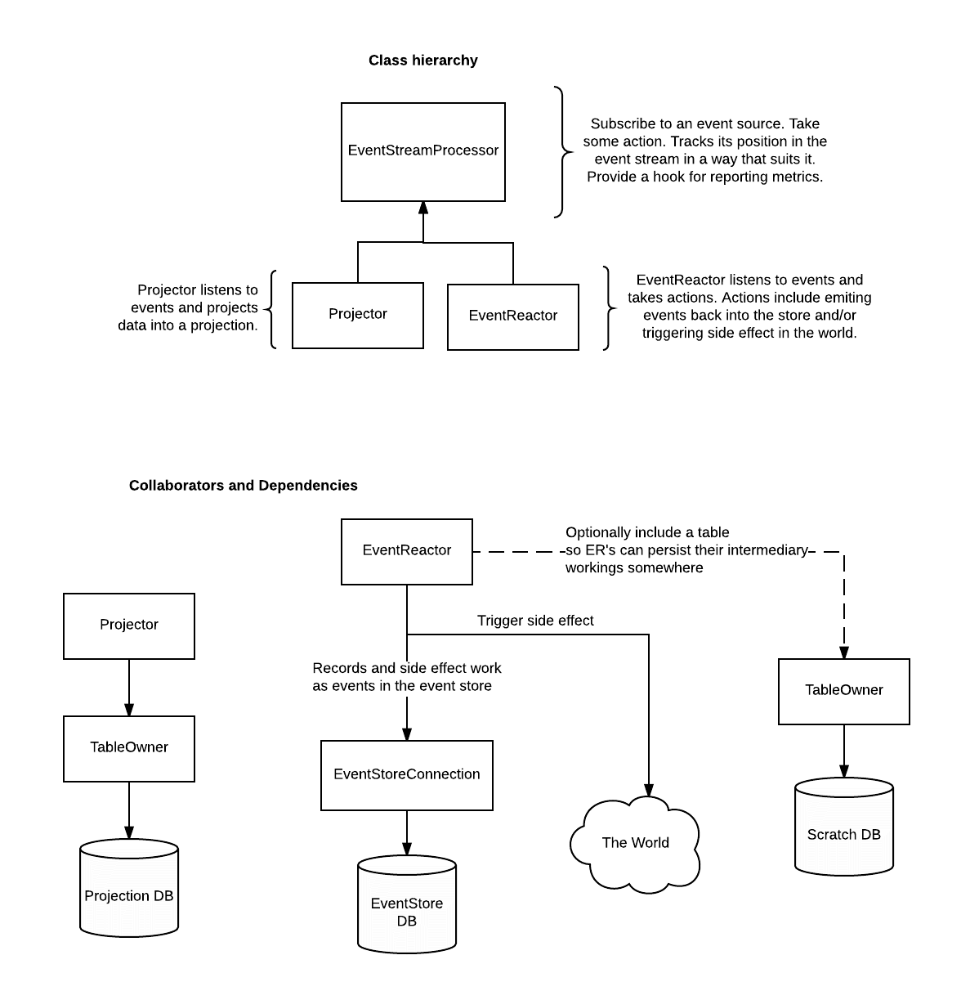
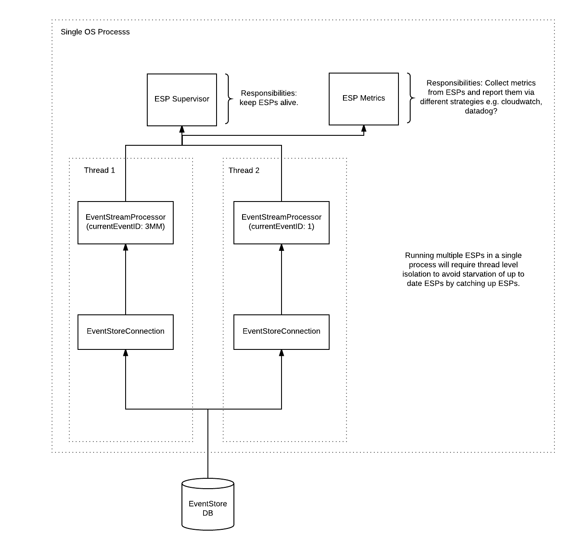

# EventSourcery Core Concepts

This document outlines some core concepts used by EventSourcery.

Start off by getting a handle on [CQRS](http://martinfowler.com/bliki/CQRS.html) and [Event Sourcing](http://www.martinfowler.com/eaaDev/EventSourcing.html).

## Events

Events represent an event that have meaning in the domain. Think of a collection of events as a time series of immutable domain facts.

Events are targetted at an `aggregate`, have a `type`, an `identifier`, a `created_at` date, and a payload (aka. `body`).

```ruby
module EventSourcery
  class Event
    include Virtus.value_object

    values do
      attribute :id, Integer
      attribute :aggregate_id, String
      attribute :type, String
      attribute :body, Hash
      attribute :created_at, Time
    end
  end
end
```

## EventStores

The event store is a persistent store of events. It provides the ability to store and read events. It is currently implemented on top of a Postgres database.

It is an immutable store of events. This time series of events can be viewed as a stream of events.

Clients can poll the store for events of specific types after a specific event ID. They can also subscribe to the event store to be notified when new events are added to the event that match the above criteria.

The event store can ensure serial storage of events against a specific aggregate ID. It currently achieves this via optimisitic locking.

```ruby
# TODO Add example of subscribing to the event store
```

## Event Stream Processors

Event Stream Processors (ESPs) subscribe to an event store. They read events from the event store and take some action.

When newly created an ESP will process the event stream from the beginning. When catching up like this an ESP will process events in batches (currently set to 1,000 events). This allows them to optimise processing if desired.

ESPs track the position in the event stream that they've processed in a way that suits them. This allows for them to optimise transaction handling in the case where they are catching up for example.

They provide an interface to report this position to upstream supervisors.

## Projectors

A Projector is an EventStreamProcessor that listens for events and projects data into a projection. These projections are generally consumed on the read side of the CQRS world.

Projectors tend to be built for specific read-side needs. They are intended to be specific to a singular read case.

Modifying a projection is achieved by creating a new projector.

## EventReactors

An EventReactor is an EventStreamProcessor that listens to events and emits events back into the store and/or trigger side effects in the world.

They typically record any external side effects they've triggered as events in the store.

## Diagrams





